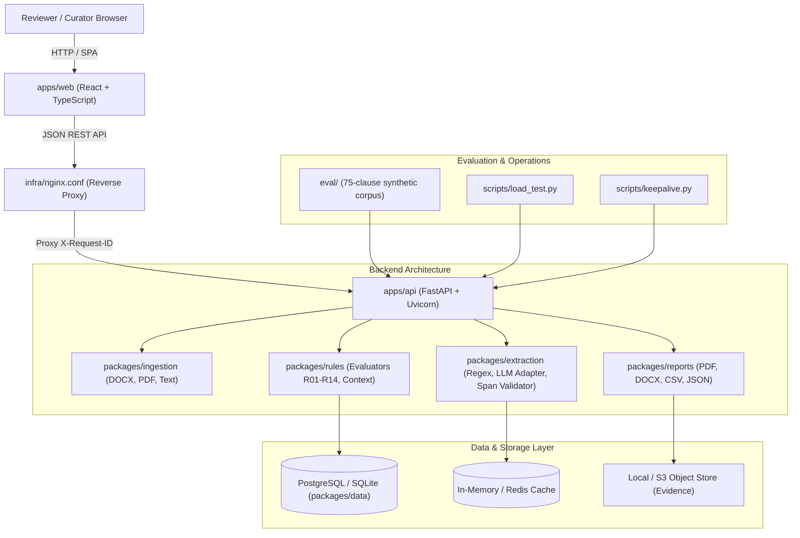

# Tender Linter: System Architecture

Team OnFocus | Team ID 176283 | SIH 2026 | Problem Statement SIH26108

> **Reviewer Banner:** This tool flags issues for the officer to review. It does not approve or reject a tender.

---

## 1. Architectural Principles

1. **The LLM only extracts:** The language model extracts citations, years, products, and vague terms. It never decides whether a clause passes or fails.
2. **Deterministic rule evaluation:** All verdicts originate from verified database rows evaluated against rules R01 to R14 in `packages/rules/`.
3. **Provenance at the core:** No standard or certification rule enters the system without a primary source URL, verified date, verifier name, and distinct second checker.
4. **Zero standard body text stored:** In strict compliance with Section 10(5) of the BIS Act 2016, the system stores and reports metadata and URLs only. Standard texts are never ingested, summarized, or reproduced.

---

## 2. Component Diagram

---

## 3. Package and Application Breakdown

Only built components are documented:

### 3.1 `apps/web` (Frontend User Interface)
- **Reviewer UI:** Interactive split-view with visual clause highlighting, finding cards, and evidence drawers.
- **Curation Console:** Provenance-enforced row creation, two-person verification queue, and bulk CSV loader.
- **System Status Dashboard:** Live health checks, test matrix results, and bilingual Hindi/English localization toggle.

### 3.2 `apps/api` (Application Programming Interface)
- **Middleware:** `RequestTracingMiddleware` injecting `X-Request-ID` and structured access logging.
- **Core Security:** Magic-byte upload safety scanner (25 MB limit, blocking binaries/scripts), role authorization (`Reviewer`, `Curator`, `Verifier`, `Admin`), and configurable retention purge.
- **Routers:** `/health` (probes), `/version` (multi-dimensional), `/auth`, `/standards`, `/products`, `/audits`, and `/admin`.

### 3.3 `packages/data` (Data Layer and Provenance)
- **Models:** `Standard`, `Product`, `ProductStandardMap`, `CertificationRule`, `AuditSession`, `AuditLog`, `User`.
- **Integrity Enforcement:** Database constraints preventing saving rows without source URL, date, and verifier != curator.
- **Legal Guard:** Automated scan preventing Indian Standard body text from entering database rows.
- **Backup & Restore:** Portable, manifest-verified `.tar.gz` snapshots with SHA-256 validation.

### 3.4 `packages/rules` (Deterministic Rules Engine)
- **Rules Catalog:** Versioned specification (`rules.yaml`) defining R01 to R14 with severity levels.
- **Context Loader:** Extracts active standards, certification rules, and maps from database into rule evaluation context.
- **Evaluators:** Standalone evaluation functions with hand-crafted extraction test coverage.

### 3.5 `packages/extraction` (Entity Extraction Service)
- **Regex Extractor:** Deterministic baseline extracting Indian Standards citations and years with zero model hallucinations.
- **Provider Adapters:** Extractor protocol with circuit breaker, token bucket rate limiter, and fallback chain.
- **Span Validator:** Verifies character offsets against original clause text and drops hallucinated spans.

### 3.6 `packages/ingestion` (Document Parsing Pipeline)
- **Parsers:** Structured extraction from `.docx`, `.pdf`, and `.txt` documents.
- **Clause Segmenter:** Numbered clause and sub-clause demarcation preserving file character offsets.

### 3.7 `packages/reports` (Export Engine)
- **Bilingual Generators:** ReportLab PDF generator, python-docx report exporter, and RFC 4180 CSV exporter.
- **Mandatory Banner:** Reviewer disclaimer printed at top of all exported documents.

### 3.8 `eval` (Evaluation Harness & Test Matrix)
- **Corpus:** 75 synthetic, team-authored test clauses with planted defects and clean controls.
- **Evaluation Runner:** Generates verified accuracy figures ("75 of 75 on synthetic-v1").
- **Load Testing:** Concurrent simulation measuring throughput and p95 latency against defined SLAs.
